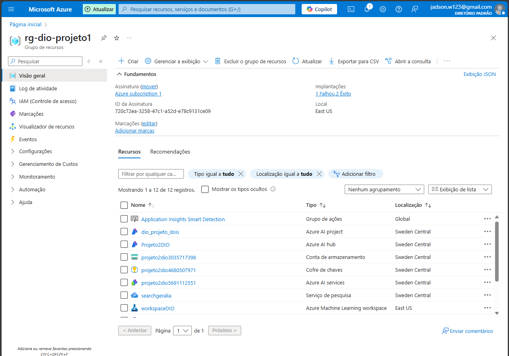
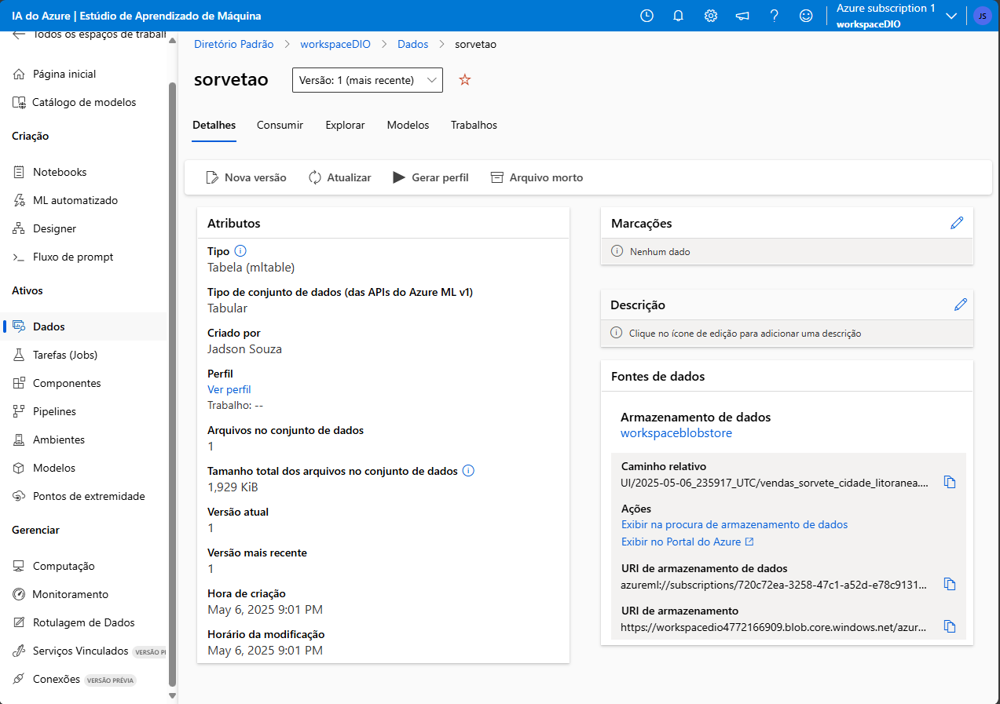
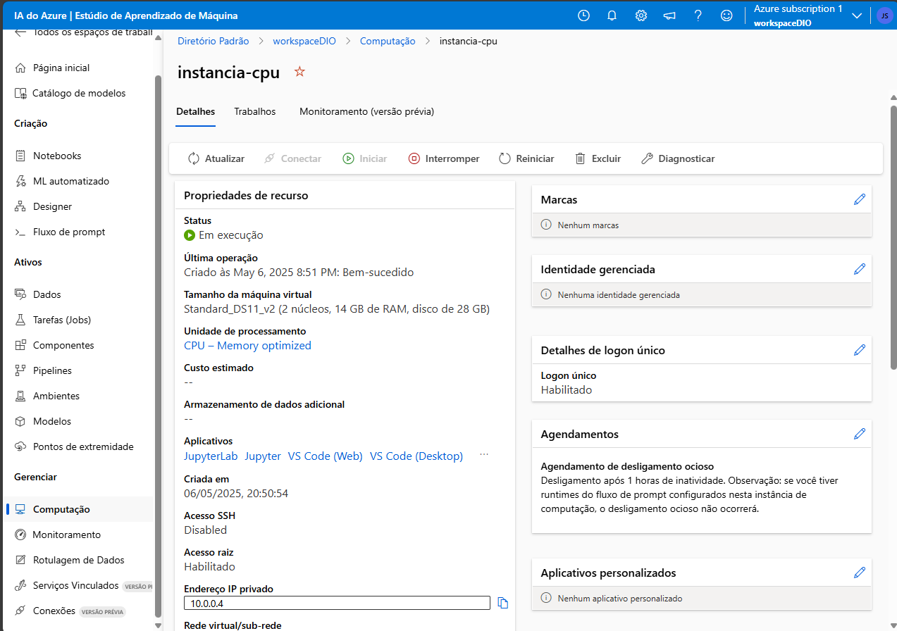
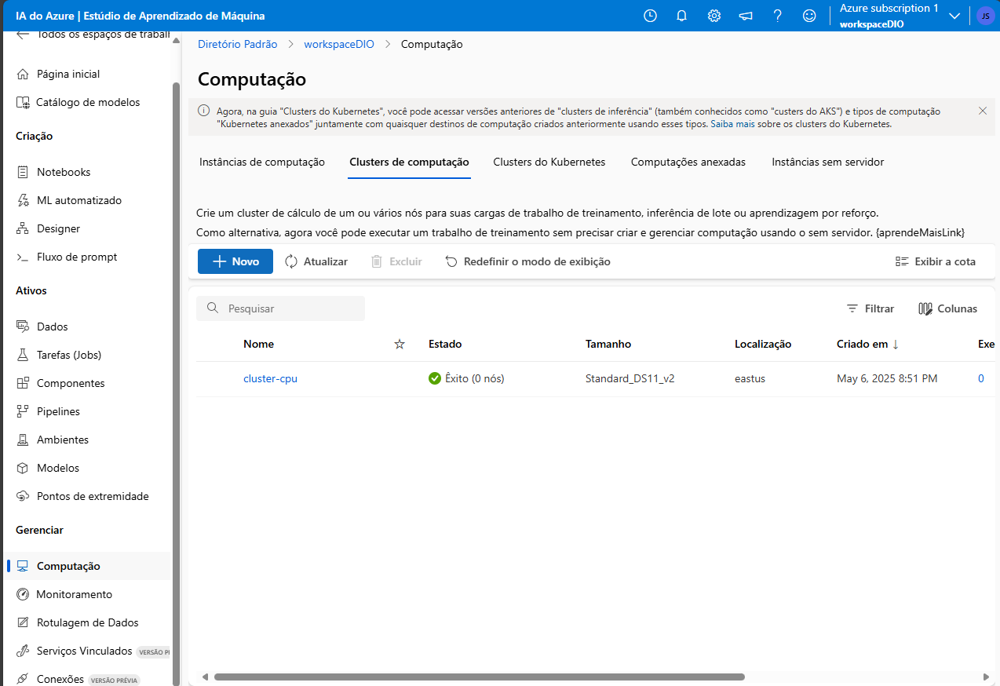
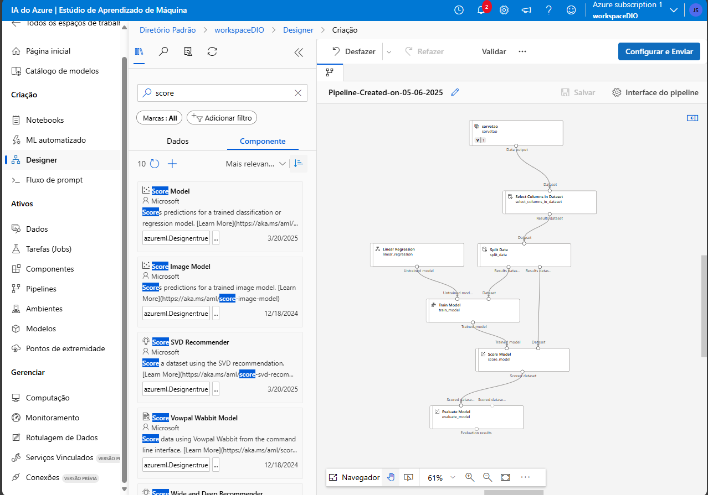
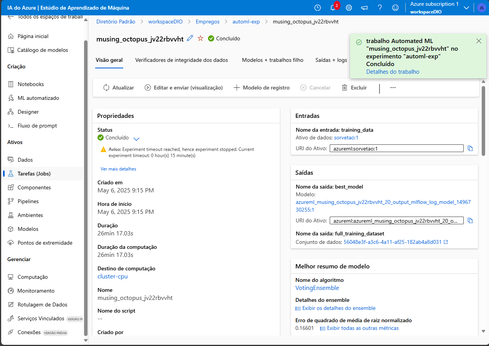
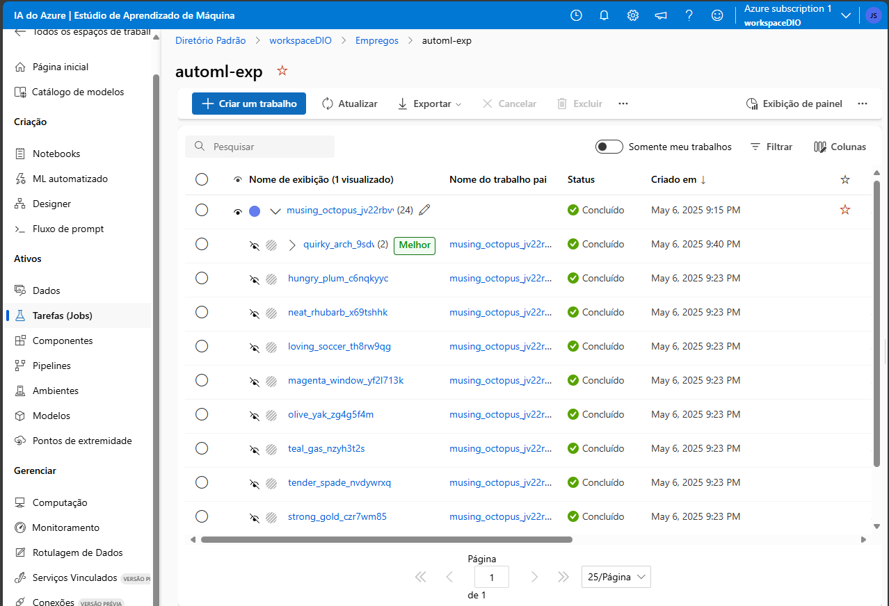

# projetoAzureML1

O projeto consiste em criar e treinar um modelo de machine learning capaz de prever a quantidade de venda de sorvetes dependendo da temperatura registrada no dia. 

Esse processo foi dividido em 4 partes: 

1. Criação do workspace; 
2. Anexação dos dados; 
3. Instânciação e clusterização de CPU; 
4. Criação de pipeline. 

## Criação do Workspace 

Ao criar o workspace chamado de workspaceDIO, foi me apresentada a opção de criar um notebook, a ferramenta que permite ao usuário executar as rotinas e configurar as atividades por meio de códigos, poupando o trabalho de as gerenciar manualmente, no entanto, escolhi executar as configurações manualmente, uma vez que assim fora exemplificado.  

## Anexação dos Dados 

Em seguida, o arquivo csv contendo as dados de quantidade de sorvetes vendidos, temperatura e data foi anexado. 

## Instanciação da Computação

A diante, o cluster e a instância de computação foram realizadas. 

## Criação de Pipeline 

Por fim, o pipeline foi estruturado. 

## Resultados 

Obtive êxito quanto aos experimentos.

